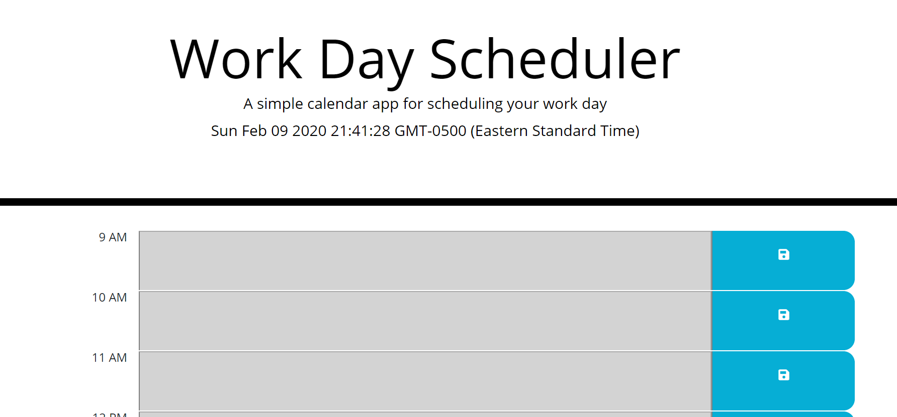

# planeador
Simple planner for the 9 to 5 time frame. This is a simple calendar application that allows the user to save events for each hour of the day. This app runs in the browser and features dynamically updated HTML and CSS powered by jQuery.

The app displays the current day and time at the top and standard business hours (9 a.m. to 5 p.m.) in time slots. Each time slot represents one hour and allows the user to hold input and save it to local storage. The hours are color coded to reflect whether the time slot is in the past, the present, or the future. This changes depending on the time of day.

Deployed site at:

[GitHub](https://tantatinta.github.io/planeador/)

